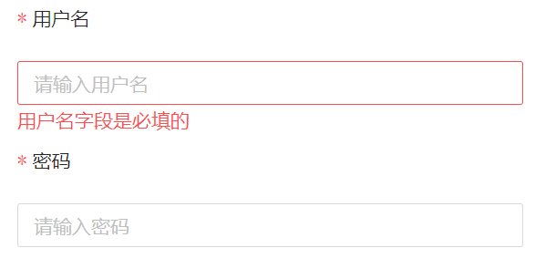

# DyFormZorro

@supine/dy-form-zorro是基于@supine/dy-form 为ng-zorro适配的开箱即用的动态表单库。

通过引入一组可维护的表单控件模型和动态表单控件组件，它完全自动化了表单UI创建

## 主要特性
- 解耦
```
传统的Angular表单开发需要成百上千行HTML，在组件内部维护大量与表单相关的代码，不利于后期维护，可读性不强。
@supine/dy-form最核心的思想就是将与表单相关的业务集中到表单模型中解决，从而减弱与组件的耦合性
```
- 高可读性
    - 所有控件配置都在表单模型中，表单结构一目了然
- 快速开发
    - 不需要成百上千行HTML，组件内部也不需要维护大量与表单相关的代码
- 面向对象
    - 表单模型、控件模型都基于class实现的，表单模型、控件模型都提供了基类，可以基于基类继承进行拓展
- 易拓展性
    - 轻松实现自定义控件

# 快速上手
- 安装

```
ng add @supine/dy-form-zorro
```

- 在模块中导入 DyFormZorroModule

- 通过脚手架生成表单模型
```
ng g @supine/dy-form:model LoginModel
```
- 通过上面的命令即可生成 LoginModel 模型内容如下

```typescript
import {BaseFormModel, InputModel, ValidatorRule} from '@supine/dy-form';

export class LoginModel extends BaseFormModel {
  @InputModel<LoginModel>({label: 'label'})
  @ValidatorRule(['max:999'], {max: '最大999'})
  exp = [null];

  /**
   * 更新表单模型钩子
   * @param formValue 当表单初始化后 formValue就为表单对象的value 否则为null
   * @param model 注册了的模型配置数组 可以根据某些条件进行过滤 来动态控制表单
   * @param params 调用 executeModelUpdate方法传的参数 以此来更加灵活来动态控制表单
   * @return 如果返回值为void 则渲染所有注册的表单控件 如果返回表单控件数组 则只渲染该数组中的控件模型
   */
  modelUpdateHook(formValue: any, model: FormControlConfig[], ...params: any[]): FormControlConfig[] | void {
    return model;
  }


  /**
   * 结合我封装的HTTP模块 可轻松实现批量对接与表单相关的接口
   * HTTP模块 目前还没开源
   * 即便不使用我封装的HTTP模块 按照以下模板 也容易实现
   */
  httpRequest() {
    // 获取表单数据 如果不能满足需要 可以在子类实现value的获取
    // const body = super.value;
    // 获取提交表单的一些外部参数 比如更新的参数ID  attachValue 通过 model.withAttachValue(数据)进行设置
    // const {mapId, id} = this.attachValue;
    //
    // body.id = id;
    // 组装接口所需要的参数
    // const tempBody = {
    //   mapId,
    //   area_info: body
    // };

    // 一系列与表单相关的接口
    // const httpRequestMap: HttpRequestMap = {
    // update: [this.http.editAreaBaseInfo, [tempBody]]
    /* UnloadMineralArea: [this.http.setUnLoadMineralArea, [body, mapId]],
       UnloadWasteArea: [this.http.setUnLoadWasteArea, [body, mapId]],
       LoadArea: [this.http.setLoadArea, [body, mapId]],
       Road: [this.http.setRoad, [body, mapId]],
       PassableArea: [this.http.setPassableArea, [body, mapId]],
       ImpassableArea: [this.http.setImPassableArea, [body, mapId]],
       Junction: [this.http.setJunction, [body, mapId]],
       create: [this.http.createMapUtil, [body, mapId]] */
    // };

    // const [handle, params] = httpRequestMap[this.actionType];
    //
    // return handle(...params);
  }
}

```

- 然后修改表单配置来生成成所需的表单

```typescript
import {BaseFormModel, InputModel, ValidatorRule} from '@supine/dy-form';

export class LoginModel extends BaseFormModel {
  @InputModel<LoginModel>({label: '用户名'})
  @ValidatorRule(['required&max:15&min:4'], {required: '用户名字段是必填的', max: '用户名长度最多为15个字符', min: '用户名长度最少为4个字符'})
  username = [null];

   @InputModel<LoginModel>({label: '密码'})
   @ValidatorRule(['required&max:15&min:4'], {required: '密码字段是必填的', max: '密码长度最多为15个字符', min: '密码长度最少为4个字符'})
   password = [null];

  /**
   * 更新表单模型钩子
   * @param formValue 当表单初始化后 formValue就为表单对象的value 否则为null
   * @param model 注册了的模型配置数组 可以根据某些条件进行过滤 来动态控制表单
   * @param params 调用 executeModelUpdate方法传的参数 以此来更加灵活来动态控制表单
   * @return 如果返回值为void 则渲染所有注册的表单控件 如果返回表单控件数组 则只渲染该数组中的控件模型
   */
  modelUpdateHook(formValue: any, model: FormControlConfig[], ...params: any[]): FormControlConfig[] | void {
    return model;
  }


  /**
   * 结合我封装的HTTP模块 可轻松实现批量对接与表单相关的接口
   * HTTP模块 目前还没开源
   * 即便不使用我封装的HTTP模块 按照以下模板 也容易实现
   */
  httpRequest() {
    // 获取表单数据 如果不能满足需要 可以在子类实现value的获取
    // const body = super.value;
    // 获取提交表单的一些外部参数 比如更新的参数ID  attachValue 通过 model.withAttachValue(数据)进行设置
    // const {mapId, id} = this.attachValue;
    //
    // body.id = id;
    // 组装接口所需要的参数
    // const tempBody = {
    //   mapId,
    //   area_info: body
    // };

    // 一系列与表单相关的接口
    // const httpRequestMap: HttpRequestMap = {
    // update: [this.http.editAreaBaseInfo, [tempBody]]
    /* UnloadMineralArea: [this.http.setUnLoadMineralArea, [body, mapId]],
       UnloadWasteArea: [this.http.setUnLoadWasteArea, [body, mapId]],
       LoadArea: [this.http.setLoadArea, [body, mapId]],
       Road: [this.http.setRoad, [body, mapId]],
       PassableArea: [this.http.setPassableArea, [body, mapId]],
       ImpassableArea: [this.http.setImPassableArea, [body, mapId]],
       Junction: [this.http.setJunction, [body, mapId]],
       create: [this.http.createMapUtil, [body, mapId]] */
    // };

    // const [handle, params] = httpRequestMap[this.actionType];
    //
    // return handle(...params);
  }
}

```
- 然后在HTML中声明动态表单
```angular2html
<jd-dy-form-zorro [dyFormRef]="dyFormRef"></jd-dy-form-zorro>
```

- 在组件中定义dyFormRef属性

```typescript
dyFormRef = new DyFormRef(LoginModel, {mode: 'vertical'});
```

- 至此就可以看到我们想要的表单啦
  

